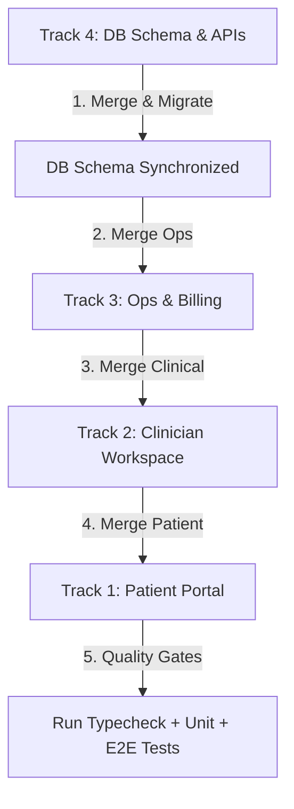

# FAANG-Grade Release Playbook: Megasprint Integration & Deployment

**Author:** Staff Product Owner, Release Engineering
**Date:** June 6, 2026
**Project:** EMR & Patient Portal Megasprint Stabilization (200 Cards)
**Target Environment:** Staging / Production
**Objective:** Integrate 4 decoupled parallel agent branches (`sprint-ms-1`, `sprint-ms-2`, `sprint-ms-3`, `sprint-ms-4`) into `main` with zero regressions, flawless schema synchronization, and robust E2E validation.

---

## 📊 High-Level Risk & Integration Assessment

We have successfully completed a 200-card development sprint across 4 isolated worktrees. However, isolated worktrees hide integration friction. To ensure a flawless launch, we must coordinate the merge sequentially based on architectural dependencies:



### Critical Dependency Vectors
1. **Schema Precedence (P0)**: Track 4 contains schema migrations (e.g. `AgentSetting`, `DefaultApprovalDecision`, `MigrationJob` tables, indices). Track 1, 2, and 3 codebases must not be merged until Track 4 is in `main` and migrated, preventing runtime query crashes.
2. **Local Storage Stubs (Technical Debt)**: Tracks 2 & 3 utilized localStorage stubs for state persistence due to the "no-schema-change" track constraint. These must be verified to ensure they fail gracefully if localStorage is cleared or server rendering (SSR) hydration mismatches occur.
3. **API Endpoint Security**: Track 4 added new `/api/*` endpoints. We must verify they sync correctly with our route auth manifest (`docs/security/route-auth.yaml`) to pass security gates.

---

## 🛠️ Step-by-Step Release Orchestration

### Phase 1: Database Migration & API Layer (Track 4)
First, we must merge Track 4 to establish the database models that other tracks will rely on.

1. **Merge Track 4 to Integration**:
   ```bash
   git checkout -b integration/sprint-ms-combine main
   git merge origin/sprint-ms-4 --no-ff -m "merge: Track 4 (DB Schema & APIs) integration"
   ```
2. **Generate Client & Push DB Schema**:
   Run the schema migration in development/staging:
   ```bash
   npx prisma generate
   npx prisma db push
   ```
3. **Verify API Integrity**:
   Verify the new endpoints (`/api/agent-settings`, `/api/approval-defaults`, `/api/credentialing`, `/api/migration-jobs`) return correct RBAC responses (e.g. 403 Forbidden for non-operators).

---

### Phase 2: Operations & Billing Layer (Track 3)
Track 3 has minimal dependencies on clinical UI but references some API boundaries.

1. **Merge Track 3**:
   ```bash
   git merge origin/sprint-ms-3 --no-ff -m "merge: Track 3 (Ops & Billing) integration"
   ```
2. **Resolve Layout Renames**:
   Resolve any conflicts in `(operator)/layout.tsx` and `command-palette.tsx` due to the "Scrub" → "Scrub and Auths" change.

---

### Phase 3: Clinician SOAP Workspace (Track 2)
Track 2 introduces the comprehensive Rx and SOAP charting features.

1. **Merge Track 2**:
   ```bash
   git merge origin/sprint-ms-2 --no-ff -m "merge: Track 2 (Clinician Workspace) integration"
   ```
2. **Resolve Shared Chart Components**:
   Ensure `chart-kit.tsx` renders correctly and does not collide with existing clinical UI styling.

---

### Phase 4: Patient Portal & Wellness (Track 1)
Track 1 is the final frontend interface layer.

1. **Merge Track 1**:
   ```bash
   git merge origin/sprint-ms-1 --no-ff -m "merge: Track 1 (Patient Portal & Wellness) integration"
   ```
2. **Resolve Navigation Conflicts**:
   Verify there are no routing overlaps in the portal layout or Shop PDP drawers.

---

## 🛡️ Automated Quality Gates (Strict FAANG Criteria)

Once all merges are complete on the `integration/sprint-ms-combine` branch, the following automated gates must pass **100% clean** before we fast-forward `main`.

### 1. Compile Check (Zero Warnings)
Ensure no TypeScript errors exist across patient, clinician, or operator modules:
```bash
npm run typecheck
```

### 2. Unit Testing Suite (Vitest)
Run the full test suite (2,800+ assertions):
```bash
npm run test
```

### 3. Playwright End-to-End Testing
Spin up the local environment and execute E2E tests:
```bash
# Verify the dev server is running on local port 3000/3001
npx playwright test
```

---

## 🧪 Manual "Smoke Room" Verification Scripts

Using the new **Sandbox Logins** utility we built, execute the following three high-fidelity manual validation passes in the browser:

### Scenario A: The Clinician Workflow (Neal Patel)
1. Navigate to `/sign-in` and click **Dr. Neal Patel (Lead Clinician)**.
2. Verify you land on `/clinic`.
3. Open a patient chart and verify the **Vitals, Scores & Labs** subtabs show active source bubbles.
4. Open the **Prescribe** module: search for a product, select dosing from the new drop-downs, and verify safety attestation triggers.

### Scenario B: The Patient Journey (Daniel Kim)
1. Navigate to `/sign-in` and click **Daniel Kim (Patient)**.
2. Verify you land on `/portal` inside the new glassmorphic card interface.
3. Click the **Are you OK?** emergency alert, verify the 15-second countdown works and is cancellable.
4. Navigate to Billing and verify that the payment CTAs are disabled with descriptive guidance.

### Scenario C: The Operator Dashboard (Sarah Thompson)
1. Navigate to `/sign-in` and click **Sarah Thompson (Operator / Admin)**.
2. Verify you land on `/ops`.
3. Open the **Documents Inbox & Outbox** tab and confirm you can toggle between incoming scans and outgoing faxes.
4. Select a denied claim and click **Take Action** to verify the 3-option modal triggers.

---

## 🚀 Rollout & Canary Strategy
1. **Canary Deploy**: Deploy `integration/sprint-ms-combine` to the staging server.
2. **Database Verification**: Confirm that the Prisma database migration runs without locks or latency on the live database.
3. **Fast-Forward**: Once staging passes, fast-forward `main` to the integration commit and push to production.
